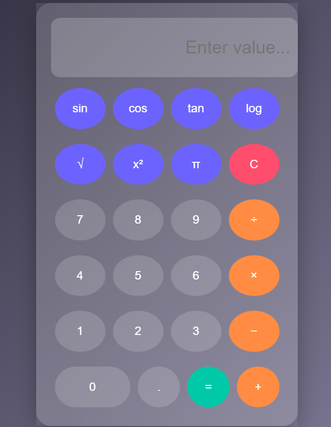

# 🔬 Smart Scientific Calculator

A modern and responsive scientific calculator built using HTML, CSS, and JavaScript with a clean glassmorphism UI.

## ✨ Features
- Basic arithmetic operations (+, -, ×, ÷)
- Scientific functions (sin, cos, tan, log, √, power)
- Degree to radian conversion for trigonometry
- Interactive UI with hover & click animations
- Clean and modern glassmorphism design

## 🛠️ Tech Stack
- HTML5
- CSS3 (Flexbox + Glass UI)
- JavaScript (Math functions)

## 📸 Screenshot

## 📂 Project Structure
smart-scientific-calculator/
│── index.html 
│── style.css  
│── script.js  

## 🧠 Learning Outcomes
- DOM manipulation using JavaScript
- Event handling
- UI/UX design principles
- Git & GitHub project management

## 📌 Future Improvements
- Add history feature
- Add keyboard support
- Implement dark/light theme toggle

---

💡 Developed by Ayushi Singh